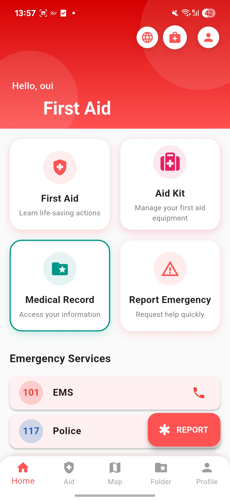
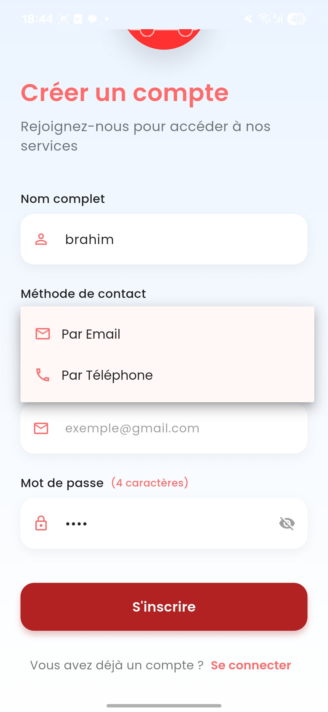
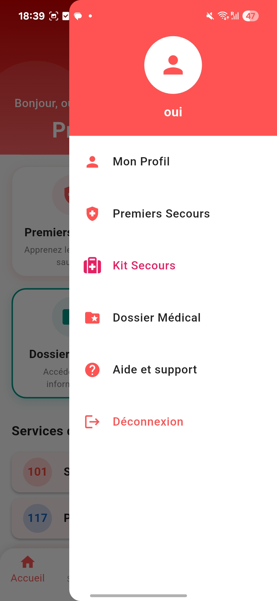
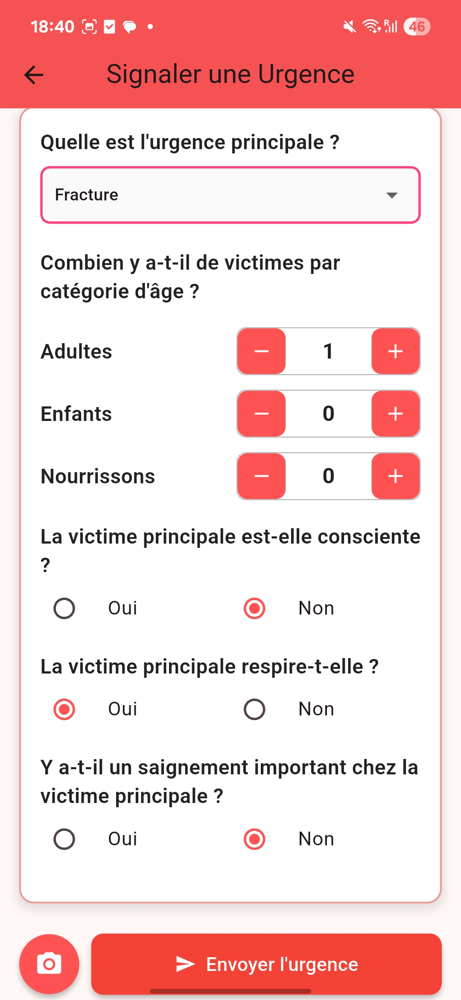
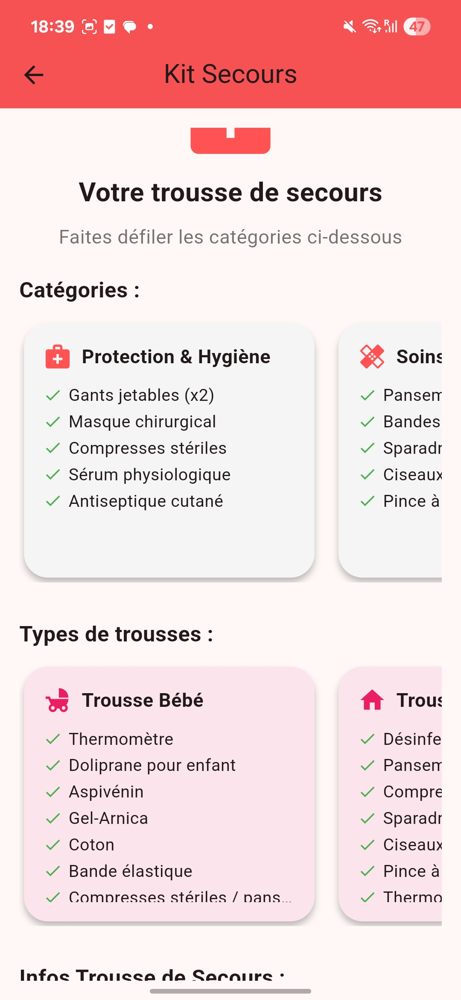
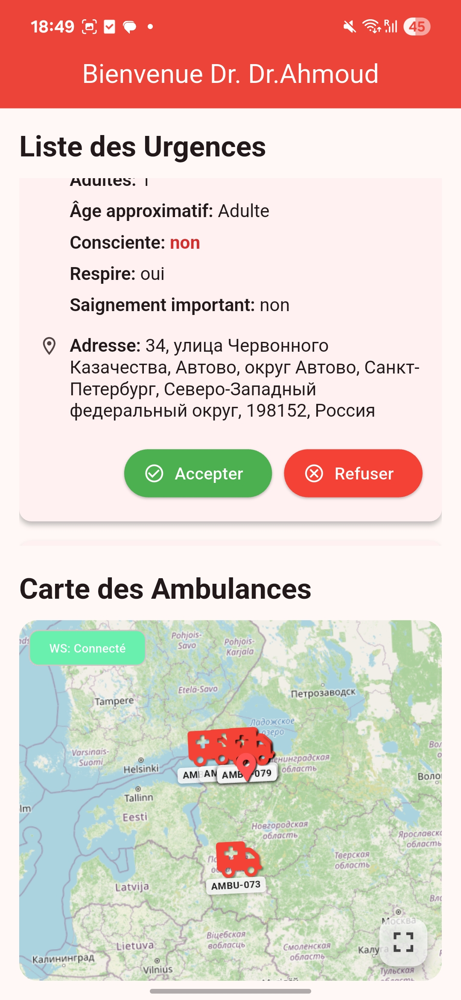
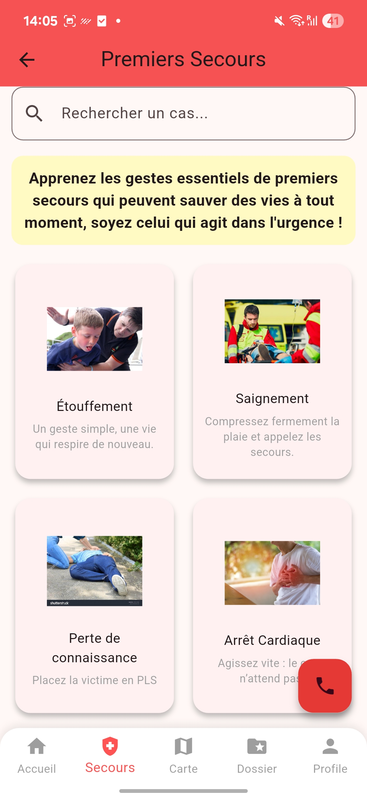

# pfe

A new Flutter project.
L’application mobile « 101 » est destinée aux citoyens (patients/témoins) et aux médecins.
Elle permet de :

Pour le citoyen :

Consulter des guides de premiers secours (hors ligne).

Signaler une urgence avec géolocalisation, photo et envoi facultatif du dossier médical.

Suivre en temps réel l’ambulance sur une carte.

Recevoir les statuts de l’intervention (acceptée, en route, terminée).

Pour le médecin :

Recevoir et visualiser les urgences signalées.

Accepter ou refuser une intervention.

Voir sur une carte les ambulances disponibles et leur position.

Suivre le trajet de l’ambulance et consulter l’historique des interventions.

## Getting Started

This project is a starting point for a Flutter application.

A few resources to get you started if this is your first Flutter project:

- [Lab: Write your first Flutter app](https://docs.flutter.dev/get-started/codelab)
- [Cookbook: Useful Flutter samples](https://docs.flutter.dev/cookbook)

For help getting started with Flutter development, view the
[online documentation](https://docs.flutter.dev/), which offers tutorials,
samples, guidance on mobile development, and a full API reference.

